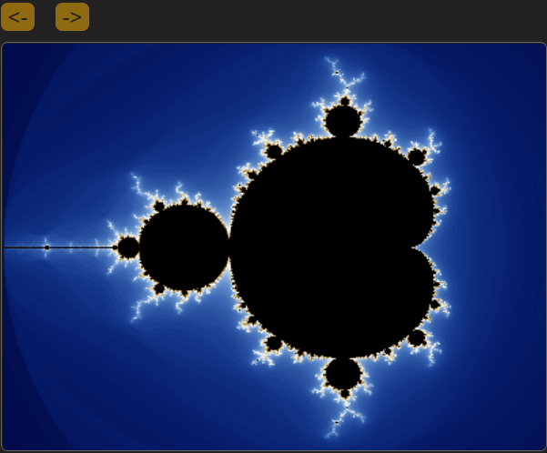

[](https://github.com/ligangwang/m/actions/workflows/cmake-app.yml) [](https://github.com/ligangwang/m/actions/workflows/cmake-wasm.yml)

# m (mlang)
mlang is a succinct & expressive general purpose programming language for WebAssembly. It aims to support imperative and functional programming paradigms and is designed with zero-overhead abstraction. It's a static-typed language with type inference, which means most of time types of variables are not required to be annotated. 

The mlang is implemented in C without third party library dependency other than C standard libraries. The mlang compiler is compiled as a WebAssembly module so it can be run in the browser or other wasm runtime like nodejs and wastime etc. It can compile m codes into another wasm module and run it in the same environment. 

MacOS or Linux or WSL is the recommended development OS.

## m code plotting mandelbrot set 
You can try [mlang](https://mlang.dev) to run the following m code in the browser.
The code will yield the following image:


You can zoom in to see more details at [https://mlang.dev](https://mlang.dev).



```
var a:u8[200][300 * 4]
let scale = 0.01, max_iter = 510
var v = 0.0, r = 0.0, g = 0.0, b = 0.0
for x in 0..300
    for y in 0..200
        let cx = -2.0 + scale*x
        let cy = -1.0 + scale*y
        var zx = 0.0, zy = 0.0
        var zx2 = 0.0, zy2 = 0.0
        var n = 0
        while n<max_iter && (zx2 + zy2) < 4.0
            zy = 2.0 * zx * zy + cy
            zx = zx2  - zy2 + cx
            zx2 = zx * zx
            zy2 = zy * zy
            n++
        if n < max_iter then
            v = (log(n+1.5-(log2((log(zx2+zy2))/2.0))))/3.4
            if v < 1.0 then 
                r = v ** 4;g = v ** 2.5;b = v
            else
                v = v < 2.0 ? 2.0 - v : 0.0
                r = v;g = v ** 1.5;b = v ** 3.0
        a[y][4*x] = n == max_iter ? 0 : (u8)(r * 255)
        a[y][4*x+1] = n == max_iter ? 0 : (u8)(g * 255)
        a[y][4*x+2] = n == max_iter ? 0 : (u8)(b * 255)
        a[y][4*x+3] = 255

setImageData a 300 200
```

## prerequisites to build m
* Source code version control: git
* Build system generator: cmake (3.16.3 is the verified version that works !, you might need to twist flags for other versions.)
* Build system: GNU make (Unix-like system)
* Compiler: c/c++ compilers: clang 13 or later

## get source codes
```
git clone https://github.com/ligangwang/m
cd m
git submodule init
git submodule update
```

## build & install wasi-libc
```
cd ./extern/wasi-libc
make (required: clang, llvm-ar, llvm-nm)
```

## build mlang as WebAssembly module
```
mkdir build
cd build
cmake -DWASM=On -DCMAKE_C_COMPILER=clang -DCMAKE_CXX_COMPILER=clang++ ..
cmake --build .
```
The build system will build mw.wasm under ./apps

Note to build m targeting LLVM backend, please refer to the [llvm build](./llvm.md) document.

# useful tools
## install clang-13 on ubuntu:
```
wget -O - https://apt.llvm.org/llvm-snapshot.gpg.key | sudo apt-key add -
sudo apt-add-repository "deb http://apt.llvm.org/focal/ llvm-toolchain-focal-13 main"
sudo apt install clang-13 lldb-13 lld-13 libclang-13-dev liblld-13-dev

sudo ln /usr/bin/clang-13 /usr/bin/clang
sudo ln /usr/bin/clang++-13 /usr/bin/clang++
sudo ln /usr/bin/llvm-ar-13 /usr/bin/llvm-ar
sudo ln /usr/bin/llvm-nm-13 /usr/bin/llvm-nm
sudo ln /usr/bin/llvm-ranlib-13 /usr/bin/llvm-ranlib
sudo ln /usr/bin/wasm-ld-13 /usr/bin/wasm-ld
sudo ln /usr/bin/llvm-config-13 /usr/bin/llvm-config
```

## compile c into wasm
```
clang --target=wasm32 --no-standard-libraries test.c -o test.wasm -mmultivalue -Xclang -target-abi -Xclang experimental-mv
```