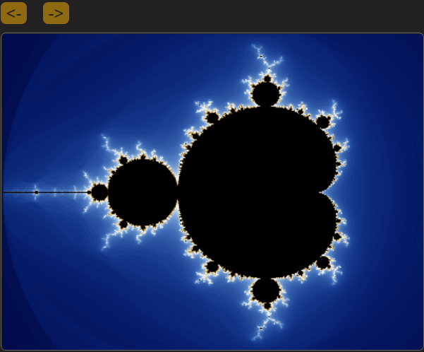

[](https://github.com/ligangwang/m/actions/workflows/cmake-m.yml) 

# m (mlang)

Mlang, also known as M, is a versatile, statically-typed programming language enhanced with type inference, 
specifically crafted for compiling to WebAssembly. 
It natively supports the [WebAssembly Component Model](https://github.com/WebAssembly/component-model) and 
[Canonical ABI](https://github.com/WebAssembly/component-model/blob/main/design/mvp/CanonicalABI.md), 
aiming to streamline development for this platform. 
While Mlang's syntax shares similarities with Python, offering a familiar and user-friendly experience, 
it is not entirely aligned with Python's syntax. 
The design philosophy of Mlang centers around merging C-level performance with Python's simplicity, 
striking a balance between efficiency and ease of use. 
This approach positions Mlang as a compelling option for developers seeking high-performance capabilities coupled with a straightforward, 
Python-esque coding experience for WebAssembly applications.

Mlang is designed to manage memory ownership and borrow lifetimes at compile time, similar to Rust. 
This approach eliminates the need for a garbage collector, leading to more predictable and stable performance. 
By doing so, Mlang achieves zero-cost abstraction, where its safety and efficiency features do not impose any runtime overhead, 
ensuring both performance optimization and memory safety.

## m code plotting mandelbrot set 
You can try [mlang](https://mlang.dev) to run the following m code in the browser.
The code will yield the following image:


You can zoom in to see more details at [https://mlang.dev](https://mlang.dev).



```
# color function returns (r, g, b) tuple based on iteration count and distance
def color(iter_count:int, iter_max:int, sq_dist:f64):
    let mut v = 0.0, r = 0.0, g = 0.0, b = 0.0
    if iter_count < iter_max:
        v = (log(iter_count+1.5-(log2((log(sq_dist))/2.0))))/3.4
        if v < 1.0:
            r = v ** 4;g = v ** 2.5;b = v
        else:
            v = v < 2.0 ? 2.0 - v : 0.0
            r = v;g = v ** 1.5;b = v ** 3.0
    ((u8)(r * 255), (u8)(g * 255), (u8)(b * 255))

/* main plot function
x0, y0: coordinate value of top left
x1, y1: coordinate value of bottom right
*/
def plot_mandelbrot_set(x0:f64, y0:f64, x1:f64, y1:f64):
    print("plot area: x0:%f y0:%f x1:%f y1:%f\n", x0, y0, x1, y1)
    let width = 400, height = 300
    let mut img:u8[height][width * 4]
    let scalex = (x1-x0)/width, scaley = (y1-y0)/height, max_iter = 510
    for x in 0..width:
        for y in 0..height:
            let cx = x0 + scalex*x
            let cy = y0 + scaley*y
            let mut zx = 0.0, zy = 0.0
            let mut zx2 = 0.0, zy2 = 0.0
            let mut n = 0
            while n<max_iter and (zx2 + zy2) < 4.0:
                zy = 2.0 * zx * zy + cy
                zx = zx2  - zy2 + cx
                zx2 = zx * zx
                zy2 = zy * zy
                n++
            let cr, cg, cb = color(n, max_iter, zx2 + zy2)
            img[y][4*x] = cr
            img[y][4*x+1] = cg
            img[y][4*x+2] = cb
            img[y][4*x+3] = 255

    setImageData(img, width, height) /*call js to set img data on canvas*/
// call main plot function
plot_mandelbrot_set(-2.0, -1.2, 1.0, 1.2)
```

# Development: vscode dev container (no manual installation)
https://user-images.githubusercontent.com/6968989/226146999-12b037e6-45e1-48e3-80e9-17282a2361ba.mp4

# or manually install tool-chains on Ubuntu-22.04 
## prerequisites to build m
* Source code version control: git
* Build system generator: cmake 
* Build system: GNU make (Unix-like system)
* Compiler: c/c++ compilers: clang/llvm 14, nodejs v18.15

## install cmake/clang/llvm/lld 
```
sudo apt update
sudo apt install cmake
sudo apt install clang lld llvm
```

## install nodejs v18.15 and typescript
### install nvm first
```
sudo apt install curl -y
curl https://raw.githubusercontent.com/creationix/nvm/master/install.sh | bash 
source ~/.profile
```

### use nvm to install node with version
```
nvm install v18.15.0
npm install -g typescript
```

# build m from source code
## get m source code
```
git clone https://github.com/ligangwang/m
cd m
git submodule init
git submodule update
npm install
```

## build & install wasi-libc
```
(cd ./extern/wasi-libc && make)
```

## build mlang
```
cmake -B build -S .
cmake --build build
```
The build system will build m and m.wasm under ./apps and run all unit tests.


# useful clang commands to compile to wasm/wasi target
## compile c code to wasm target
```
clang --target=wasm32 --no-standard-libraries test.c -o test.wasm -mmultivalue -Xclang -target-abi -Xclang experimental-mv
```

## compile c into wasi target
```
clang --target=wasm32-wasi --sysroot=../extern/wasi-libc/sysroot hello.c -o hello.wasm -nodefaultlibs -lc -v
```
or manually invoke clang front-end and back-end as two steps:

use front-end clang to produce wasm object file
```
clang -cc1 -triple wasm32-unknown-wasi -emit-obj -internal-isystem /usr/lib/llvm-14/lib/clang/14.0.0/include -internal-isystem ./extern/wasi-libc/sysroot/include -o hello.o -x c hello.c
```

then use back-end wasm-ld to produce wasm module
```
wasm-ld -m wasm32 -L./extern/wasi-libc/sysroot/lib/wasm32-wasi ./extern/wasi-libc/sysroot/lib/wasm32-wasi/crt1-command.o hello.o -lc -o hello.wasm
```

